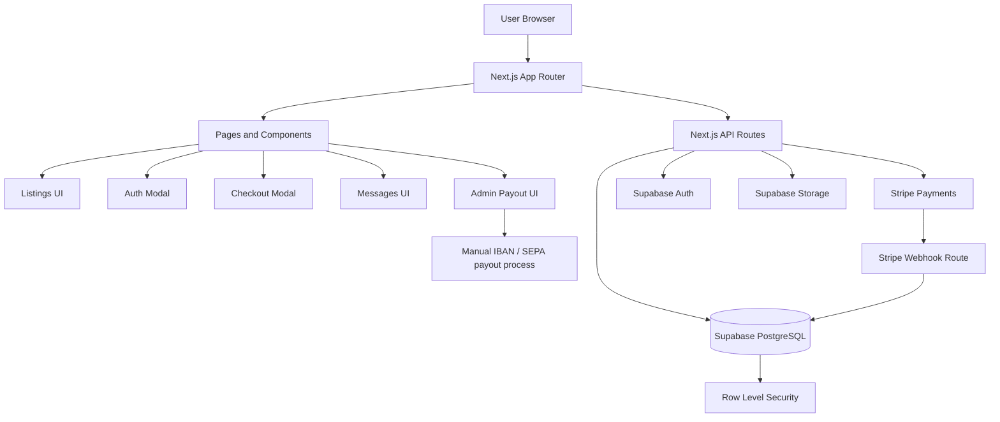
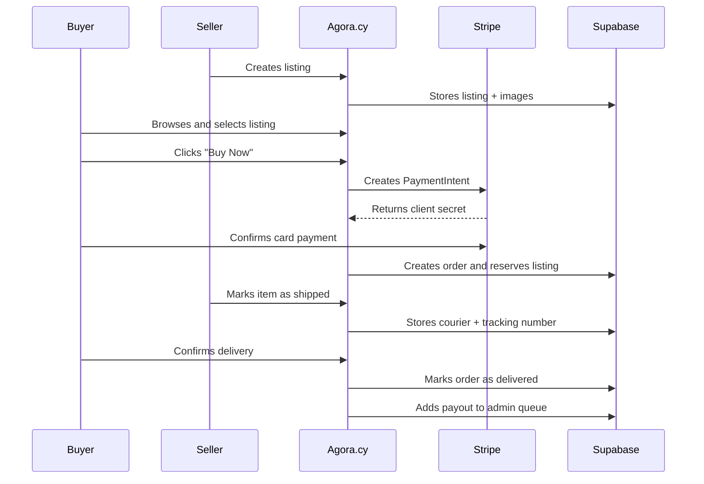
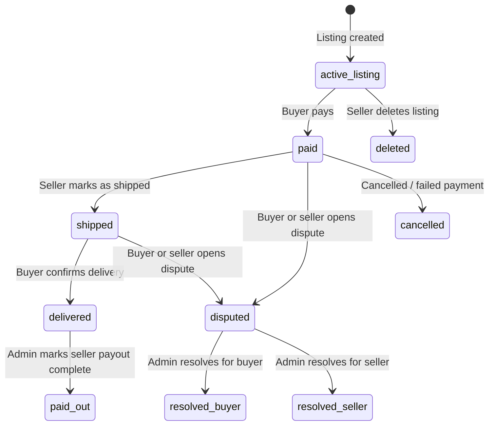
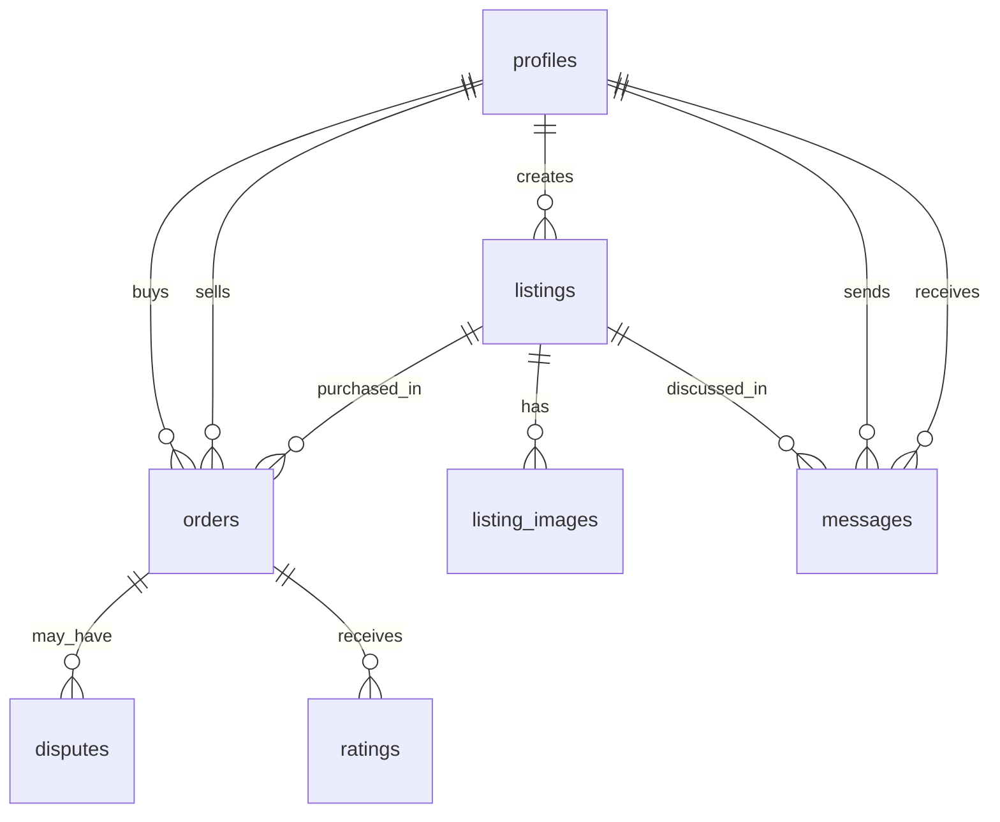
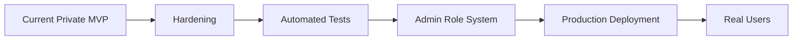

<div align="center">

# 🏛️ Agora.cy

### A Cyprus-focused marketplace for safe buying, selling, messaging, escrow payments and seller payouts.

<p>
  
  
  
  
  
</p>

**Agora.cy** is a full-stack marketplace web application built with **Next.js**, **TypeScript**, **Supabase**, and **Stripe**.
It supports product listings, authentication, real-time-style messaging, protected checkout, escrow-style order handling, seller shipment tracking, disputes, IBAN payout management, and admin review tools.

</div>

---

## Table of Contents

* [Overview](#overview)
* [Core Features](#core-features)
* [System Architecture](#system-architecture)
* [Marketplace Flow](#marketplace-flow)
* [Escrow Order Lifecycle](#escrow-order-lifecycle)
* [Database Overview](#database-overview)
* [Project Structure](#project-structure)
* [Tech Stack](#tech-stack)
* [Environment Variables](#environment-variables)
* [Local Development](#local-development)
* [Quality Checks and CI](#quality-checks-and-ci)
* [Security Notes](#security-notes)
* [Roadmap](#roadmap)
* [Rights](#rights)

---

## Overview

Agora.cy is designed as a modern online marketplace for Cyprus users. The platform allows users to create listings, browse items by category and location, communicate with sellers, pay securely, track order progress, and handle disputes through a protected flow.

The system is not just a static listing website. It includes a transaction workflow with payment intent creation, order confirmation, delivery confirmation, dispute handling, and admin payout management.

---

## Core Features

### Marketplace

* Create, view and manage listings.
* Upload listing images through Supabase Storage.
* Browse listings by category, condition, location and price.
* Search listings by title.
* Highlight promoted listings.
* View seller profile information and rating metadata.

### Authentication

* Supabase authentication.
* Email/password login and registration.
* Google OAuth support.
* Protected routes for creating listings and viewing the user profile.
* Auth callback handling through the Next.js App Router.

### Payments and Escrow-Style Orders

* Stripe PaymentIntent creation.
* Platform fee calculation.
* Buyer payment through Stripe Elements.
* Order creation after successful payment.
* Listing status update from `active` to `reserved`.
* Seller shipment update with courier and tracking number.
* Buyer delivery confirmation.
* Admin-managed payout flow using seller IBAN details.

### Disputes

* Buyer or seller can open a dispute.
* Order status changes to `disputed`.
* Escrow-style flow freezes the normal payout path.
* Admin can inspect open disputes.

### Admin Payout Dashboard

* Protected admin payout route.
* Lists delivered orders waiting for payout.
* Displays seller, buyer, listing and IBAN details.
* Allows admin to mark orders as paid out.
* Supports payout notes such as SEPA reference numbers.

### Support and Information Pages

* Safety guidance.
* GDPR/privacy page.
* Terms page.
* Contact page.
* How-it-works page.
* Floating FAQ-style live chat widget in Greek.

---

## System Architecture



The frontend and backend live in the same Next.js project. Public pages, protected pages, API routes and server-side integrations are organised under the `app/` directory.

---

## Marketplace Flow



---

## Escrow Order Lifecycle



The database status fields are used to control what actions are available to each user. The normal transaction path is:

```text
paid → shipped → delivered → paid_out
```

When something goes wrong, the order can move into:

```text
disputed
```

This prevents the normal payout flow until an admin reviews the case.

---

## Database Overview

The Supabase schema is stored inside the `supabase/` folder.



### Main Tables

| Table            | Purpose                                                    |
| ---------------- | ---------------------------------------------------------- |
| `profiles`       | User profile data, seller metadata and IBAN payout details |
| `listings`       | Marketplace listings                                       |
| `listing_images` | Images attached to listings                                |
| `orders`         | Buyer/seller transaction records                           |
| `messages`       | User-to-user listing conversations                         |
| `disputes`       | Dispute records connected to orders                        |
| `ratings`        | Post-transaction reviews                                   |
| `wishlists`      | Saved listings                                             |

### SQL Files

| File                             | Purpose                                           |
| -------------------------------- | ------------------------------------------------- |
| `supabase/schema.sql`            | Main database schema and RLS policies             |
| `supabase/MASTER-MIGRATION.sql`  | Idempotent migration for production-style updates |
| `supabase/functions.sql`         | Helper database functions and search index        |
| `supabase/session4-realtime.sql` | Messaging and realtime-related migration          |
| `supabase/session7-iban.sql`     | IBAN payout fields and payout tracking            |

---

## Project Structure

```text
.
├── app/
│   ├── page.tsx
│   ├── layout.tsx
│   ├── globals.css
│   ├── listings/
│   │   ├── page.tsx
│   │   ├── new/page.tsx
│   │   └── [id]/page.tsx
│   ├── profile/
│   │   ├── me/page.tsx
│   │   └── [id]/page.tsx
│   ├── messages/page.tsx
│   ├── admin/payouts/page.tsx
│   ├── auth/callback/page.tsx
│   ├── connect/return/page.tsx
│   ├── contact/page.tsx
│   ├── gdpr/page.tsx
│   ├── how-it-works/page.tsx
│   ├── safety/page.tsx
│   ├── terms/page.tsx
│   └── api/
│       ├── checkout/
│       ├── orders/
│       ├── admin/payouts/
│       ├── connect/
│       ├── profile/update-bank/
│       ├── seed/
│       └── webhooks/stripe/
├── components/
│   ├── AuthModal.tsx
│   ├── CheckoutModal.tsx
│   ├── FilterSidebar.tsx
│   ├── ImageUpload.tsx
│   ├── ListingCard.tsx
│   ├── LiveChat.tsx
│   ├── MessageModal.tsx
│   └── Navbar.tsx
├── lib/
│   ├── listings.ts
│   ├── messages.ts
│   ├── mock-auth.ts
│   ├── mock-data.ts
│   ├── stripe.ts
│   ├── theme.tsx
│   └── supabase/
│       ├── client.ts
│       └── server.ts
├── supabase/
│   ├── MASTER-MIGRATION.sql
│   ├── schema.sql
│   ├── functions.sql
│   ├── session4-realtime.sql
│   └── session7-iban.sql
├── public/
├── proxy.ts
├── package.json
├── tsconfig.json
├── eslint.config.mjs
└── next.config.ts
```

---

## Tech Stack

| Layer             | Technology                                       |
| ----------------- | ------------------------------------------------ |
| Framework         | Next.js 16 App Router                            |
| Language          | TypeScript                                       |
| UI                | React 19, custom CSS, Lucide icons               |
| Animation         | Framer Motion                                    |
| Backend           | Next.js API routes                               |
| Database          | Supabase PostgreSQL                              |
| Authentication    | Supabase Auth                                    |
| Storage           | Supabase Storage                                 |
| Payments          | Stripe PaymentIntents, Stripe Elements, Webhooks |
| Deployment Target | Vercel                                           |
| Package Manager   | npm                                              |

---

## Environment Variables

Create a local `.env.local` file in the project root.

```bash
# Supabase
NEXT_PUBLIC_SUPABASE_URL=
NEXT_PUBLIC_SUPABASE_ANON_KEY=
SUPABASE_SERVICE_ROLE_KEY=

# Stripe
STRIPE_SECRET_KEY=
NEXT_PUBLIC_STRIPE_PUBLISHABLE_KEY=
STRIPE_WEBHOOK_SECRET=

# Admin
ADMIN_SECRET=
NEXT_PUBLIC_ADMIN_SECRET=

# App
NEXT_PUBLIC_APP_URL=http://localhost:3000
```

Important:

* Do **not** commit `.env.local`.
* `SUPABASE_SERVICE_ROLE_KEY` must only be used server-side.
* `STRIPE_SECRET_KEY` must only be used server-side.
* `NEXT_PUBLIC_*` variables are visible to the browser.
* For production, store secrets in Vercel or GitHub Actions secrets, not in the repository.

---

## Local Development

### 1. Install dependencies

```bash
npm install
```

### 2. Create `.env.local`

Add the environment variables listed above.

### 3. Prepare Supabase

Run the database SQL from the `supabase/` directory in the Supabase SQL Editor.

Recommended order:

```text
supabase/schema.sql
supabase/functions.sql
supabase/MASTER-MIGRATION.sql
```

Use the session migration files only when needed for incremental updates.

### 4. Start the development server

```bash
npm run dev
```

Open:

```text
http://localhost:3000
```

---

## Quality Checks and CI

The repository currently has quality-check scripts, not a full automated test suite.

Available checks:

```bash
npm run lint
npx tsc --noEmit
npm run build
```

### Can CI tests be added?

Yes. The most sensible first CI pipeline is:

1. Install dependencies with `npm ci`.
2. Run ESLint.
3. Run TypeScript type-checking.
4. Run the production build.

This is useful even without a formal test suite because it catches broken imports, TypeScript errors, lint problems and build failures before changes are merged.

A GitHub Actions workflow can be added at:

```text
.github/workflows/ci.yml
```

Recommended CI workflow:

```yaml
name: CI

on:
  push:
    branches: [main]
  pull_request:
    branches: [main]

jobs:
  lint-typecheck-build:
    runs-on: ubuntu-latest

    env:
      NEXT_PUBLIC_SUPABASE_URL: https://example.supabase.co
      NEXT_PUBLIC_SUPABASE_ANON_KEY: dummy-anon-key
      SUPABASE_SERVICE_ROLE_KEY: dummy-service-role-key
      STRIPE_SECRET_KEY: sk_test_dummy
      NEXT_PUBLIC_STRIPE_PUBLISHABLE_KEY: pk_test_dummy
      STRIPE_WEBHOOK_SECRET: whsec_dummy
      ADMIN_SECRET: dummy-admin-secret
      NEXT_PUBLIC_ADMIN_SECRET: dummy-admin-secret
      NEXT_PUBLIC_APP_URL: http://localhost:3000

    steps:
      - name: Checkout repository
        uses: actions/checkout@v4

      - name: Setup Node.js
        uses: actions/setup-node@v4
        with:
          node-version: 20
          cache: npm

      - name: Install dependencies
        run: npm ci

      - name: Run ESLint
        run: npm run lint

      - name: Run TypeScript check
        run: npx tsc --noEmit

      - name: Build application
        run: npm run build
```

### Future Real Tests

For stronger CI, add:

| Test Type       | Suggested Tool        | What It Should Test                          |
| --------------- | --------------------- | -------------------------------------------- |
| Unit tests      | Vitest                | Fee calculation, helpers, formatters         |
| Component tests | React Testing Library | Listing cards, modals, auth UI               |
| API tests       | Vitest / MSW          | Checkout, orders, disputes                   |
| E2E tests       | Playwright            | Register, create listing, checkout mock flow |
| SQL validation  | Supabase CLI          | Migration validity and RLS behaviour         |

A good first real unit test target is the Stripe fee calculation in `lib/stripe.ts`.

---

## Security Notes

This project handles payments, user data and admin actions, so security needs to be treated seriously.

### Already Present

* Supabase Row Level Security policies.
* Protected profile and listing creation routes.
* Server-side API routes for privileged actions.
* Service role key used only in server-side files.
* Stripe webhook route.
* Admin payout route protected by an admin secret.
* `.env*` files ignored by Git.

### Important Improvements Before Production

* Remove any client-side exposure of admin secrets.
* Do not rely on `NEXT_PUBLIC_ADMIN_SECRET` for real security.
* Replace simple admin password flow with role-based admin accounts.
* Add rate limiting to checkout, dispute, auth-sensitive and admin routes.
* Validate request bodies with a schema library such as Zod.
* Add server-side ownership checks everywhere money or order status can change.
* Store and display audit logs for payout decisions.
* Use Stripe test mode until the full payment and dispute flow is verified.
* Review all RLS policies before using real customer data.

---

## Roadmap



### Suggested Next Steps

* Add unit tests for payment fee logic.
* Add Playwright tests for the main marketplace flow.
* Add proper admin role management.
* Add richer search using Supabase full-text search.
* Add order audit logs.
* Add email notifications for shipment, delivery and disputes.
* Add production monitoring and error tracking.

---

## License

Copyright (c) 2026 Prodromos Chrysostomou. **All Rights Reserved.**

This is proprietary software. No part of this codebase may be copied, modified, distributed, sublicensed, published, or used in any way without the prior express written permission of the copyright holder. See [LICENSE](LICENSE) for the full terms.

This repository is publicly viewable for portfolio and demonstration purposes only.
